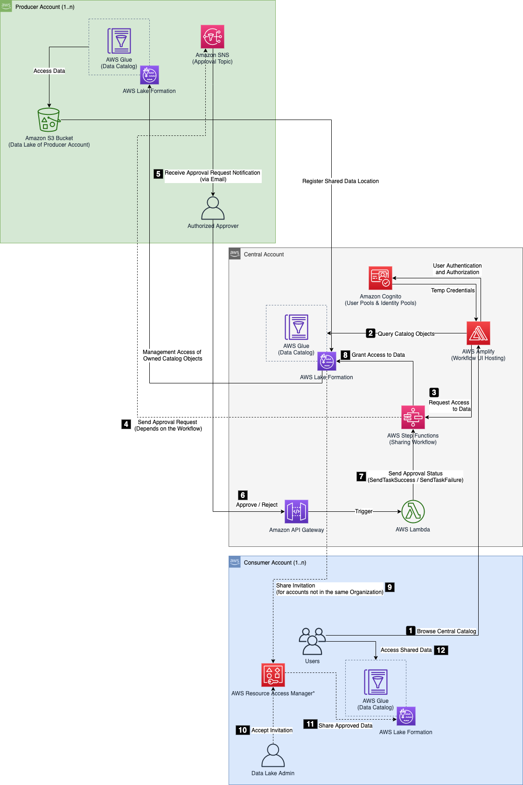

# Data Lake Workflow UI

This application demonstrates how to build an approval workflow to provide a consistent experience for data consumers to request access to specific data sets from data producers. The underlying workflow logic has the following basic condition:

- If the table doesn't have any PII column (identified with a `pii_flag` parameter at the column level) then the request would be automatically approved and the catalog item shared to the target account.
- If the table does have PII column, it will assume a role (`ProducerWorkflowRole`) in the relevant producer account and public a message to the target SNS topic (`DataLakeSharingApproval`). Emails that are registered in the topic would receive the email and can approve/deny the request directly.

The data owner is identified using a table level parameter `data_owner` which points to the producer account ID.

## Architecture



## Components

The application consists of the following components:

### Central Mesh
The central mesh holds all the catalog items collated from the different producer accounts. Since the `GRANT` API calls would be done in this account, it makes sense to host the workflow engine as well as the relevant resources in this account. The breakdown are as follows:

- IAM roles for the Lambda functions and the Step Function
- Lambda functions to support the Step Function and API Gateway
- API Gateway (to receive the approve/deny response)
- Step Function contains the actual workflow itself
- (**Optional**) Cognito User Pools and Identity Pools to support the UI. If the UI is not deployed, then this is not needed.
    - More importantly, the authenticated role associated with the Identity Pools should have at least a `DESCRIBE` access to all the tables in the databases so that it can be displayed in the UI. In addition, the following IAM inline policy:
        ```
            {
                "Effect": "Allow",
                "Action": [
                    "glue:GetDatabase",
                    "glue:GetTables",
                    "glue:GetDatabases",
                    "glue:GetTable"
                ],
                "Resource": "*"
            },
            {
                "Effect": "Allow",
                "Action": [
                    "states:ListExecutions",
                    "states:StartExecution"
                ],
                "Resource": [
                    "arn:aws:states:<REGION>:<ACCOUNT_ID>:stateMachine:<STATE_MACHINE_NAME>"
                ]
            },
            {
                "Effect": "Allow",
                "Action": [
                    "states:DescribeExecution"
                ],
                "Resource": [
                    "arn:aws:states:<REGION>:<ACCOUNT_ID>:execution:<STATE_MACHINE_NAME>:*"
                ]
            }
        ```
- (**Optional**) React application deployed in Amplify hosting. If the UI is not deployed, then this is not needed.

### Producer Accounts
The different producer accounts holds the actual data in their respective S3 buckets. These are then shared to the Central Mesh so they can be included in the central catalog for ease of searching. The producer accounts owns the data so the final approval is up to them. To support the workflow engine, the following are the breakdown of the components:
- `ProducerWorkflowRole` is the role that would be assumed by the workflow engine if it needs to send the approval request.
- `DataLakeSharingApproval` is the SNS Topic where the approval request would be published. Relevant stakeholders in the producer team can subscribed their email addresses to get notified for requests. They can then click either approve/deny link embedded in the email to response accordingly to the request.
