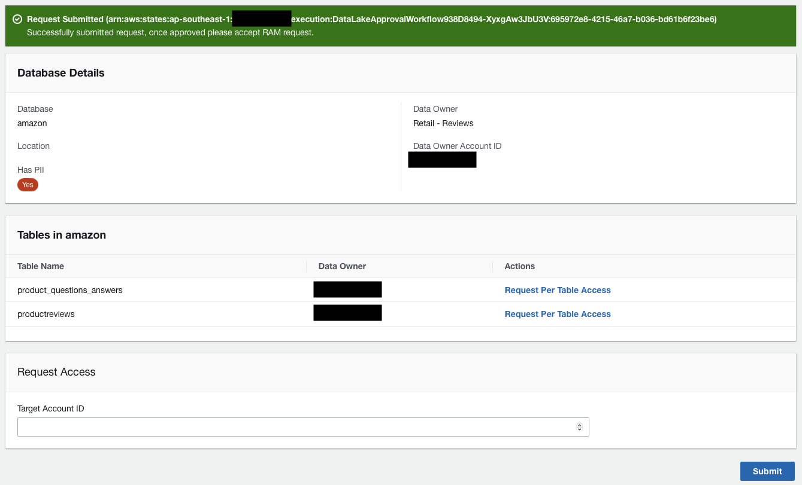
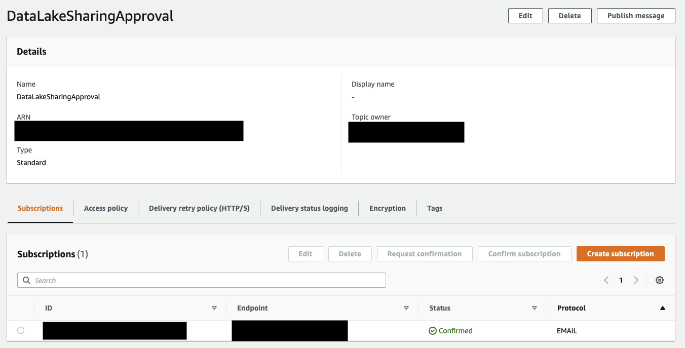
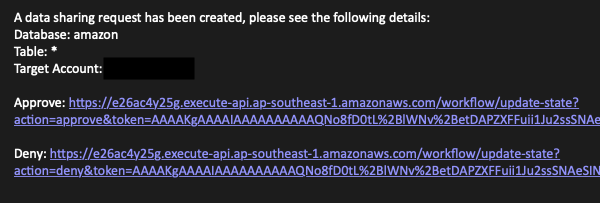

# Data Lake Workflow UI

This application demonstrates how to build an approval workflow to provide a consistent experience for data consumers to request access to specific data sets from data producers. The underlying workflow logic has the following basic condition:

- If the table doesn't have any PII column (identified with a `pii_flag` parameter at the column level) then the request would be automatically approved and the catalog item shared to the target account.
- If the table does have PII column, it will assume a role (`ProducerWorkflowRole`) in the relevant producer account and public a message to the target SNS topic (`DataLakeSharingApproval`). Emails that are registered in the topic would receive the email and can approve/deny the request directly.

The data owner is identified using a table level parameter `data_owner` which points to the producer account ID.

## Architecture


## Components

The application consists of the following components:

### Central Mesh
The central mesh holds all the catalog items collated from the different producer accounts. Since the `GRANT` API calls would be done in this account, it makes sense to host the workflow engine as well as the relevant resources in this account. The breakdown are as follows:

- IAM roles for the Lambda functions and the Step Function
- Lambda functions to support the Step Function and API Gateway
- API Gateway (to receive the approve/deny response)
- Step Function contains the actual workflow itself
- (**Optional**) Cognito User Pools and Identity Pools to support the UI. If the UI is not deployed, then this is not needed.
    - More importantly, the authenticated role associated with the Identity Pools should have at least a `DESCRIBE` access to all the tables in the databases so that it can be displayed in the UI. In addition, the following IAM inline policy:
        ```
            {
                "Effect": "Allow",
                "Action": [
                    "glue:GetDatabase",
                    "glue:GetTables",
                    "glue:GetDatabases",
                    "glue:GetTable"
                ],
                "Resource": "*"
            },
            {
                "Effect": "Allow",
                "Action": [
                    "states:ListExecutions",
                    "states:StartExecution"
                ],
                "Resource": [
                    "arn:aws:states:<REGION>:<ACCOUNT_ID>:stateMachine:<STATE_MACHINE_NAME>"
                ]
            },
            {
                "Effect": "Allow",
                "Action": [
                    "states:DescribeExecution"
                ],
                "Resource": [
                    "arn:aws:states:<REGION>:<ACCOUNT_ID>:execution:<STATE_MACHINE_NAME>:*"
                ]
            }
        ```
- (**Optional**) React application deployed in Amplify hosting.

### Producer Accounts
The different producer accounts holds the actual data in their respective S3 buckets. These are then shared to the Central Mesh so they can be included in the central catalog for ease of searching. The producer accounts owns the data so the final approval is up to them. To support the workflow engine, the following are the breakdown of the components:
- `ProducerWorkflowRole` is the role that would be assumed by the workflow engine if it needs to send the approval request.
- `DataLakeSharingApproval` is the SNS Topic where the approval request would be published. Relevant stakeholders in the producer team can subscribed their email addresses to get notified for requests. They can then click either approve/deny link embedded in the email to response accordingly to the request.

## Deployment

### Prerequisites
The following are the deployment requirements:

- A data mesh setup
- NodeJS v14.x
- Yarn v1.22.10+
- The [AWS Cloud Development Kit (AWS CDK)](https://docs.aws.amazon.com/cdk/latest/guide/cli.html) CLI v1.119.0+
- The [Amplify CLI](https://docs.amplify.aws/cli/start/install/) v5.3.0+ (for the workflow UI)
- AWS Profiles for each of the accounts (central and producers) that you would be deploying in.

You can clone the workflow UI and AWS CDK scripts from the [GitHub repository](https://gitlab.aws.dev/jantan/datamesh-workflow).

### Central Account
To deploy the backend for the central account, go to the root of the project after cloning the GitHub repository and enter the following code:

`yarn deploy-central --profile <profile_of_central_account>`

When the deployment is complete, it generates a JSON file in the `src/cfn-output.json` location. This file is used by the workflow UI to locate the state machine that was created by the AWS CDK script.

The actual AWS CDK scripts for the central account deployment can be found in `infra/central/`. This also includes the Lambda functions (in the `infra/central/functions/` folder) that are used by both the state machine and the API Gateway.

### Producer Account
To deploy the backend for your producer accounts, go to the root of the project and run the following commands:

`yarn deploy-producer --profile <profile_of_producer_account> --parameters centralMeshAccountId=<central_account_account_id>`

You can run this deployment script multiple times, each time pointing to a different producer account that you want to participate in the workflow. 

### Workflow UI
The Workflow UI is designed to be deployed in the central account where the central data catalog is located. 

To start the deployment, enter the following command:

`yarn deploy-ui`

This command will prompt for a number of information such as the following:
-	Project information. You can use the default values for this section.
-	AWS Authentication. For this section, use your profile for the central account. Amplify would use this profile to deploy the backend resources.
-	UI Authentication. You can use the following values:
    - Use default configuration
    - Use username
    - Select, “No, I am done” when asked to configure advanced settings.
-	UI Hosting. You can use the following values:
    - Use Hosting with Amplify Console.
    - Select manual deployment

#### Example Screenshots
The Workflow UI will show all the databases that can be viewed by the consumers:


Clicking on "Request Access" will drill down to the database details screen where the list of tables can be viewed


You can drill down to table level by clicking “Request Per Table Access” and see more details


Going back in the previous screen, we will request database level access by putting in the consumer account ID which would receive the share request.



Since this database has been tagged with a `pii_flag`, the workflow would need to send an approval request to the product owner. To receive this approval request email, the product owner’s email would need to be subscribed in the `DataLakeSharingApproval` Amazon SNS topic in the product account. It would look something like this:



The email would look something like this:



The product owner would then click “Approve” to trigger the Step Functions to continue the execution and share the catalog item to the consumer account.

For this example, the consumer account is not part of an Organization, so that means the admin of the consumer account would then have to go to the Resource Access Manager and accept the invitation. The screen would look something like this:


After accepting the resource share, the shared database would then appear in the consumer’s account’s catalog.

## Clean Up

### Central Account
Run the following command to remove the workflow backend in the central account:

`yarn clean-central --profile <profile_of_central_account>`

### Producer Account
To remove the deployed resources in producer accounts, run the following command for each of the producer account that you deployed in:

`yarn clean-producer --profile <profile_of_producer_account>`

### Workflow UI
The clean-up script for the Workflow UI relies on AWS Amplify’s CLI command to initiate the tear down of the deployed resources, in addition, there’s a custom script that is used to remove the inline policy in the authenticated IAM role used by Amazon Cognito so that Amplify can fully clean up all the deployed resources. Run the following command to trigger the clean-up:

`yarn clean-ui`

Take note that this command doesn’t require the profile parameter since it uses the existing Amplify configuration to infer where the resources are deployed and which profile was used.
